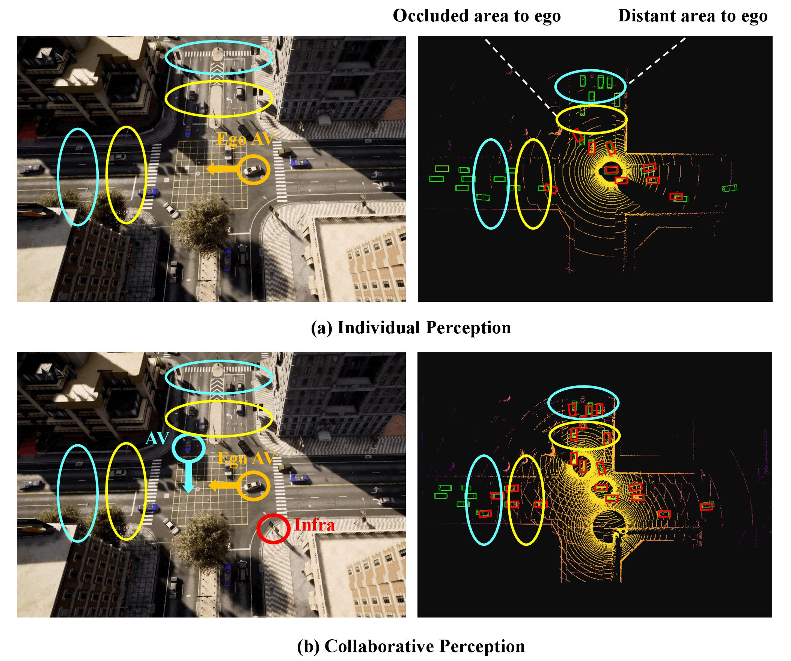

#  Collaborative Perception in Autonomous Driving Survey

This repo is constructed for collecting and categorizing papers about collaborative perception according to our ITSM survey paper: 
[***Collaborative Perception in Autonomous Driving: Methods, Datasets and Challenges***](https://arxiv.org/abs/2301.06262)

<a href="#methods">Methods</a>/
<a href="#datasets">Datasets</a>/
<a href="#challenges">Challenges</a>/

## Methods
### Methods for Ideal Scenarios
- Raw data fusion
- Customized communication mechanism
- Feature fusion
- Customized loss function
- Output fusion

### Methods for Real-world Issues
- Localization errors
- Communication issues
- Model or task discrepancies
- Privacy and security issues

## Datasets

## Challenges
- Transmission Efficiency in Collaborative Perception
- Collaborative Perception in Complex Scenes
- Federated Learning-based Collaborative Perception
- Collaborative Perception with Low Labeling Dependence

